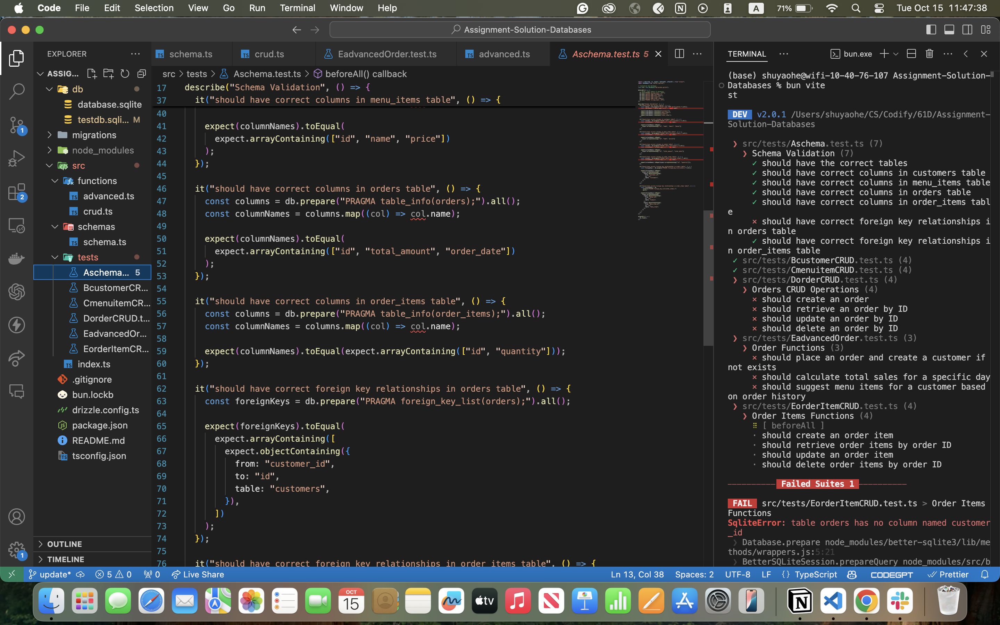
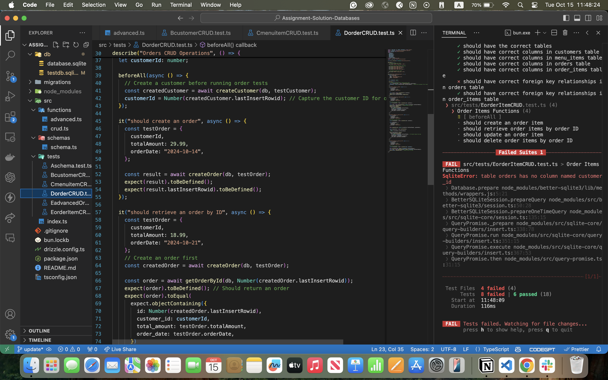

# 61d-database-homework

To install dependencies:

```bash
bun install
```

# Vitest to be fixed

All tests related to the Orders table are failing. It seems to be related to the way we test for foreign relations. However, the same structure works for the OrderItems table so I'm a bit confused.


I couldn't test DorderCRUD.test.ts, EorderItemCRUD.test.ts, or FAdvancedOrder.test.ts since they all need to call createOrder and the test suggests that createOrder is missing this "customer_id" column. I'm not sure if it has to do with the schema definition or the vitest.

